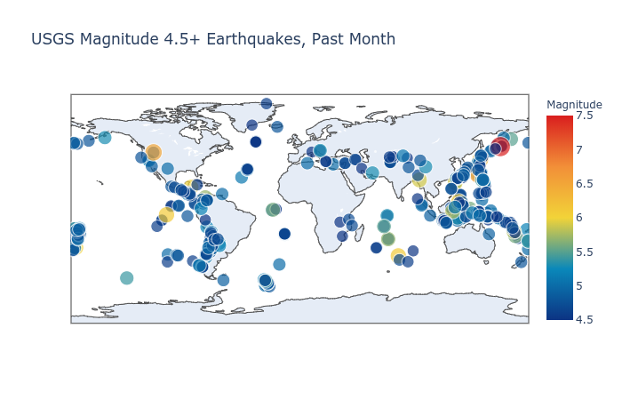

# Global Earthquakes- Visualization
A visualisation project which reads a json file and produces a visual view of global earthquakes from the past week

 
  
  For html click [here](https://siddhantv10.github.io/globalEarthquakes/ ). 

# Problem
Showing the quantity and magnitude of earthquakes cumulatively over time is a challenge due to visual overlap.

# Visualisation

Used Scattergeo and layout modules of plotly package and json module to create an html visaualisation of global distribution of significant (magnitude 4.5+) earthquakes that occurred in the world in the last month (400+) with location coordinates and magnitude scale

Seismic data was extracted from the US Geological Survey earthquake catalog.
